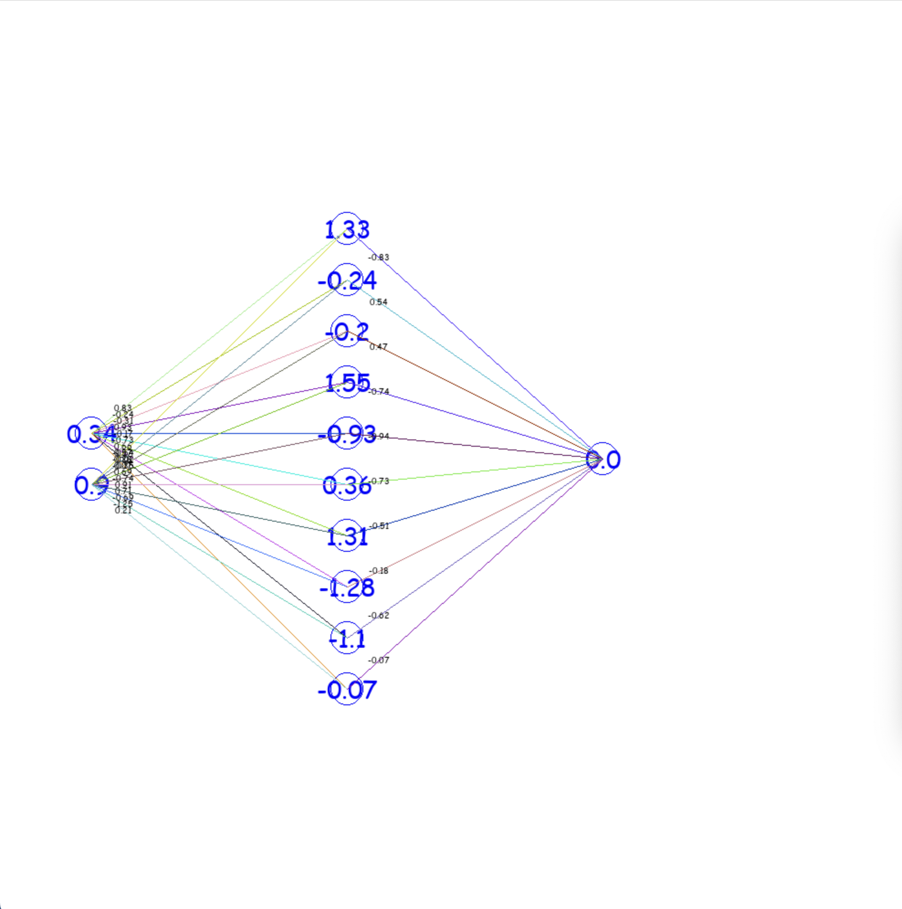
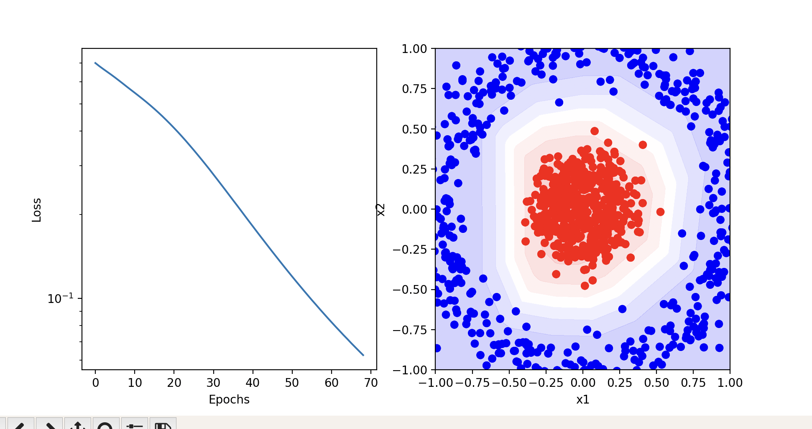

## Deep Learning Project - Suren, Daniel, Mehjabin, Samad
## Neural Network Visualization

This repository is the visualizes the learning process (feedforward to calculate output, error computation, backpropagation through the output to alter weights).
With the help of this project we can detect the error of each layer.
### Dataset

We use make_circles Dataset from sklearn.

### Description

We have three main files.
main.py, utils.py and visualize.py

#### main.py
- Defines the sequential model.
- For the two dense layers, we used Relu and Sigmoid activation functions.
- We used "adam" for optimization.
- In this file, we generate the datasets.

#### visualize.py
- We use pygame library for the visualization.
- We use TensorFlow.
- We define the screen width and height to 1000.
- For each neuron we define it's color, radius and value.
````
class Neuron:

    def __init__(self, x, y, radius, color, value, font_size=5):
        self.x = x
        self.y = y
        self.radius = radius
        self.color = color
        self.value = value
        self.font_size = font_size
````
- We assign blue color for the neurons.
- 2 indicates the neuron numbers for the first layer.
- 10 indicates the neuron numbers for the second layer.
- 1 indicates the neuron numbers for the third layer.

````
def awake(self):
        self.scene.append(Network(100, 530, 3, 18, (0, 0, 255), [linear, relu, sigmoid],[], 2, 10, 1))
````




### Results


